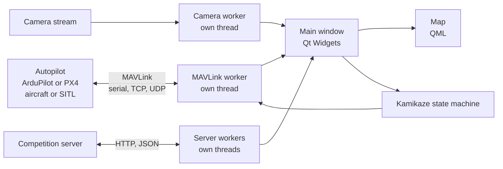

# Uav Control Interface, developed and used by ARES Team

Ground control station for a fixed-wing fighting UAV, developed and used by the ARES team. It connects to the autopilot over MAVLink, shows telemetry, map and camera on one screen, exchanges data with the competition server and runs the autonomous manoeuvres the team needs.

Python · PySide6 (Qt Widgets + QML) · pymavlink

> **About this repository.** This is an independently maintained continuation of
> [kadir1243/SihaInterface](https://github.com/kadir1243/SihaInterface). The project was created and
> primarily developed by Muzaffer Kadir Belen. See [Origin and credits](#origin-and-credits) for who
> built what and where this repository diverges.

## Screenshots


*The interface running against ArduPilot SITL and Gazebo: telemetry watch list and kamikaze controls on the left, the simulated camera with the target rectangle at the top, the map below.*


*The X-UAV Mini Talon model used in the Gazebo simulation.*

## What it does

A competition flight needs several things at once: the state of the aircraft, its position relative to the other aircraft and the no-fly zones, the camera picture, a live data exchange with the competition server, and manoeuvres that have to be flown autonomously. Doing this with a general-purpose ground station plus separate scripts means switching windows in the middle of a flight.

SihaInterface puts all of it in one application built around the team's own workflow:

- the **watch list** shows the flight data the operator chose to see,
- the **map** shows the own aircraft, the others, the no-fly zones, the geofence and the mission,
- the **camera panel** shows the video, reads QR codes and records,
- the **server link** sends telemetry and receives targets and zones,
- the **kamikaze controls** start and supervise the autonomous dive.

## Features

### Vehicle link
- MAVLink over **serial, TCP or UDP**, on a worker thread separate from the UI.
- Works with **ArduPilot** and **PX4**, each with its own flight-mode table.
- Live watch list: ground speed, air speed, velocity, altitude and relative altitude, yaw, pitch, roll, GPS time, position, battery, arm status, flight mode and fence breach status.
- Mode changes, arming, and guided **repositioning** from the map (plain, or advanced with a chosen loiter radius).
- Mission download with waypoint and path visualisation; **geofence** upload and download.
- Critical parameter writes are confirmed against the vehicle's reply and retried if a packet is lost.
- Telemetry stream rates are set to fit a 57600 baud radio link.

### Map
- QML map showing the own aircraft, the other aircraft reported by the server, air-defence zones, the geofence, the mission path and the reposition target.
- Air-defence zones can be added by hand or taken from the server.
- Configurable mouse and keyboard bindings for the map actions.

### Camera and QR detection
- Three video stream protocols, selectable in the camera dialog.
- Target-area rectangle overlay for lock-on.
- **QR detection** with OpenCV and zxing-cpp / pyzbar. A plain frame is tried first; if nothing is found, contrast, illumination, sharpening, upscaling and motion-deblur stages are tried in turn, and the stage that worked is tried first on the next frame.
- Two recorders: a kamikaze-run recording of what the operator sees, and an **evaluation video** (H.264/MP4 through ffmpeg) with the server time stamped on each frame.

### Kamikaze dive
- A state machine with four phases: **approach, dive, recover, resume**.
- The target comes from the competition server, or from a local file when flying without a server.
- Each phase has its own parameter table; the normal flight envelope is defined once and restored after every run, so a manoeuvre cannot leave the aircraft with altered limits.
- The run is flown in guided mode, so it counts as autonomous flight.

### Route planning
- **Route preplanner** that steers around no-fly zones using a visibility graph and shortest-path search.
- Resumes a mission from the closest waypoint when entering auto mode.

### Competition server
- Login, periodic telemetry upload and reception of the other aircraft.
- No-fly zone and QR target coordinates from the server.
- Kamikaze and lock-on reports.
- The "autonomous" flag in telemetry is derived from the vehicle's actual flight mode.

### Interface
- Theme and colour editor, English and Turkish translations, key-binding editor.

## How it is built



1. **Everything that waits runs off the UI thread.** The MAVLink link, the camera stream, the server polling and the route planner each run on their own thread or in a thread pool and report back through Qt signals. A slow radio link or a silent server does not freeze the window.
2. **Telemetry is table-driven.** Each watched value is one table entry naming the MAVLink message it comes from, its update rate and its update function. Adding a value means adding an entry.
3. **Flight limits live in one place.** `src/FlightParams.py` holds the flight-envelope constants and the parameter tables that write them to the vehicle. A check at import time fails if a manoeuvre changes a parameter that the baseline does not restore.
4. **The map is QML, the rest is Qt Widgets.** The map and its mouse handling are a QML scene fed by Python models; dialogs and panels come from Qt Designer files.

## Advantages

- **One tool for the whole flight.** Telemetry, map, camera, server and manoeuvres without switching applications.
- **Same interface for the aircraft and the simulator.** Serial for the real link, TCP or UDP for SITL and Gazebo.
- **Responsive under bad links.** Blocking work is kept off the UI thread.
- **Guarded parameter handling.** Confirmed writes, retries and a single definition of the normal flight envelope.
- **Two autopilot families.** ArduPilot and PX4 mode tables.
- **Adaptable interface.** Themes, key bindings, two languages; runs on Windows and Linux.

## Getting started

Requirements: Python 3.14 or newer, [uv](https://docs.astral.sh/uv/), and `ffmpeg` on the `PATH` for the UDP video protocol and evaluation recording.

```
git clone --recurse-submodules https://github.com/EmirAkay-007/SihaInterface.git
cd SihaInterface
uv sync
uv run main.py
```

After changing a `.ui` file, regenerate the Python side with `generate_ui_files_for_python.sh` (Linux/macOS) or `generate_ui_files_for_python.bat` (Windows).

### Running against the simulator

1. Start ArduPilot SITL with Gazebo.
2. Open the UAV connection dialog and connect over TCP or UDP.
3. The simulated camera is streamed over UDP port 5600. Open the camera dialog, choose the UDP video protocol and enter the address with port 5600.
4. To try the kamikaze run without the competition server, put the target in a local `kamikaze_test_target.json` file: `{"lat": 39.9044, "lon": 41.2370}`.

## Project layout

| Path | Contents |
|---|---|
| `main.py` | entry point |
| `src/MainInterface.py` | main window, MAVLink worker, telemetry, kamikaze state machine |
| `src/MapWidget.py`, `qml/map_widget.qml` | map, input handling, map models |
| `src/CameraWidget.py` | stream protocols, overlays, recorders |
| `src/barcode.py` | QR / barcode detection |
| `src/FlightParams.py` | flight envelope constants and parameter tables |
| `src/RoutePreplanner.py` | no-fly zone avoidance and route planning |
| `src/ServerConnection.py`, `src/HSSPollingWorker.py` | competition server API |
| `ui_files/` | Qt Designer files and translations (git submodule) |
| `ui_files_python/` | Python generated from `ui_files/` |

## Development

The project will continue to be developed.

## Origin and credits

This repository is based on [kadir1243/SihaInterface](https://github.com/kadir1243/SihaInterface), the ground control interface of the ARES team. The Qt Designer files in `ui_files/` come from [kadir1243/siha_arayuz](https://github.com/kadir1243/siha_arayuz).

**Original project**

- **Muzaffer Kadir Belen** ([@kadir1243](https://github.com/kadir1243)) created the project and wrote most of it: the application structure, MAVLink handling, the map, geofence and mission features, the camera stack, server telemetry, and the theme, key-binding and translation systems.
- **Yusuf İslam İnan** wrote the autonomous route preplanner with no-fly zone avoidance and the mission and geofence serialisation work.
- **Emir Akay** ([@EmirAkay-007](https://github.com/EmirAkay-007)) designed and wrote the kamikaze guidance and the QR detection, and the flight-envelope and parameter handling that the kamikaze run depends on.

At the point where this repository diverges, the history holds 101 commits by kadir1243, 11 by Emir Akay and 6 by Yusuf İslam İnan. All of it is preserved here with its original authorship.

**Independent development**

After commit `01a93ce` (22 August 2026), this repository is developed independently by Emir Akay. It does not follow later changes in the original project. Changes since that point:

- **Parameters.** Reworked flight-envelope and parameter tables, manual-throttle pass-through, and telemetry stream rates grouped and tuned for the radio link.
- **Server data.** The autonomous-mode flag is derived from the flight-mode tables for both ArduPilot and PX4, and stays off until the first heartbeat arrives.
- **Simulator connection.** The ground station identifies itself with its own MAVLink system and component ID on every transport, the UDP video input is buffered for the simulated camera, and map input works on Linux (X11).
- **Recording.** Evaluation video recorder with server-time overlay, and a fixed location for kamikaze recordings.

The full list is in the commit history.

## License
All Changes commited by kadir1243 are licensed under AGPL-v3.0, until this project opened to public all changes made by kadir1243 are under All rights reserved

The Kamikaze Guidance and QR Detection algorithms were exclusively designed and developed by EmirAkay-007. All commits related strictly to these two modules are licensed under AGPL-v3.0. Until the project is made public, all rights regarding these algorithms are reserved by EmirAkay-007.

**Additional notes for this repository**

- The two paragraphs above are the license notices of the original project, kept as they were written.
- Changes made by Emir Akay after commit `01a93ce` are licensed under AGPL-3.0.
- The original project publishes no separate license statement for the contributions of Yusuf İslam İnan. They remain his work and are kept here unchanged, with authorship preserved in the commit history.
- The full text of the AGPL-3.0 is in `LICENSE-kadir1243.txt`.
- The About dialog and the copyright notice of the original author are retained in the application.
